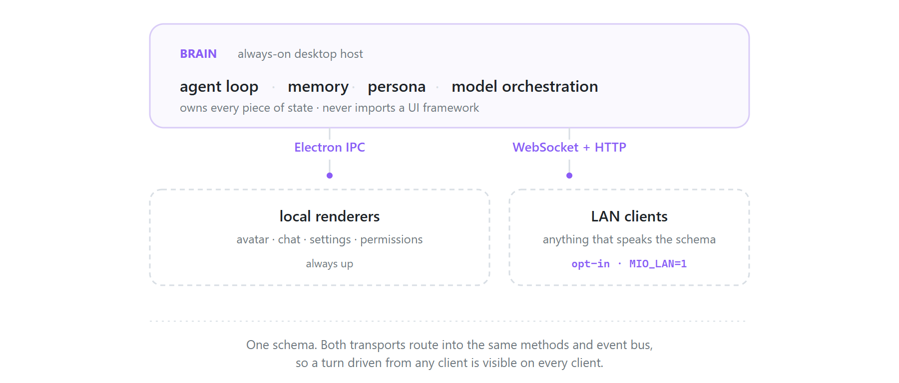

<div align="center">

# Mio

**A persistent VRM-avatar AI assistant for Windows.**

It runs continuously, keeps memory across sessions, watches the screen on its own
schedule, and decides for itself when something is worth interrupting for.

<sub>Electron · TypeScript · Three.js + three-vrm · SQLite · Anthropic + Gemini</sub>

<table>
<tr>
<td width="25%" valign="top"></td>
<td width="75%" valign="top"></td>
</tr>
<tr>
<td align="center"><sub>Avatar overlay — transparent, frameless, always on top</sub></td>
<td align="center"><sub>Settings — sessions, agent bounds, tools, permissions, gestures</sub></td>
</tr>
</table>

</div>

## Architecture

Mio separates a **brain** from its **surfaces**. The brain owns everything
stateful — the agent loop, the memory store, the persona, model orchestration —
and never imports a UI framework. Surfaces are thin clients that reach it over
whichever transport suits them.

<div align="center">
<picture>
  <source media="(prefers-color-scheme: dark)" srcset="docs/media/architecture-dark.png">
  
</picture>
</div>

**The brain is platform-agnostic by construction.** `src/server/brain/**` has
zero imports from `electron`. Every platform capability it needs — paths, secret
storage, screenshots, active-window title, notifications, outbound HTTP — crosses
a `HostAdapter` interface. A headless build supplies a different adapter and the
brain does not notice. The invariant verifies in one line:

```bash
rg -n "from 'electron'" src/server     # expected: 0 matches
```

**One contract serves both transports.** `shared/protocol.ts` defines a
`ServerMethodMap` of RPC verbs and a `ServerEventMap` of push events. Electron
IPC and the WebSocket server route into the same `methods.ts` and subscribe to
the same event bus, so a turn driven from any client is visible on every client
and backed by one database. A client is anything that can send
`{ method, args }` and read back `{ ok, result }`.

The avatar renderer holds to the same standard: it detects its host at runtime
rather than assuming Electron, so the identical Three.js scene renders inside a
plain WebView. That portability is why the renderer and protocol carry explicit
platform branches.

## Memory and recall

**Recall is a hybrid retrieval pipeline, not a similarity lookup.** Every chat
turn runs BM25 over an FTS5 index *and* cosine over the vector store, merges the
two rankings with Reciprocal Rank Fusion, applies Maximal Marginal Relevance
(λ = 0.7) so the results are not near-duplicates of one another, then passes the
survivors through a Flash reranker with a score floor before taking the top six.
Short queries are held to raised similarity floors, since a four-word message
carries too little signal to trust a close match.

**The vector store needs no vector extension.** A single SQLite file via
`better-sqlite3` holds the embeddings as BLOBs alongside everything else. They
are L2-normalized *at write time*, so cosine similarity collapses to a dot
product at query time. At personal-assistant scale this behaves identically to
`sqlite-vec` with one less native dependency, and migrating later is a one-table
swap.

**Compaction demotes rather than deletes.** Once context exceeds its threshold,
older observations are summarized and the originals are *demoted* — still in the
database, dropped from the recall set. The transcript grows without bound; the
recall budget does not.

## The autonomous loop

**Spending limits are database rows, not prompt instructions.** Daily counters
for cycles, tokens, notifications and images are enforced in SQL. A model that
decides to be chatty cannot spend its way past them.

**The interrupt bar is the hard part.** Roughly every ten minutes the loop
examines the screen, reasons about it, and writes a private JSON note to memory.
Surfacing anything is a deliberate decision against a high bar — *would the
operator be glad this was raised?* An assistant that speaks every ten minutes is
a nuisance, so most cycles observe and stay silent.

## The avatar surface

**Touch is real input.** The overlay projects the VRM's bones and spring-bone
chains into screen space each frame and hit-tests the cursor against metre-based
zones, classifying eight gesture verbs — caress, poke, pat, tickle, stroke, grab,
tug, pinch — from dwell, travel and press. Each becomes a synthetic user turn the
model responds to in character.

**Computer use runs without a native module.** Screenshots go in; mouse and
keyboard come out through PowerShell P/Invoke into `user32.dll`, under a
watchdog, behind a permission gate with a classifier, an approval dialog and an
audit log.

**Stored language is uniform.** Everything persisted — messages, observations,
compaction summaries, embeddings — is Japanese. A single language keeps the
vector space clean and lets TTS read straight off the same buffer that history
replays from. The Traditional Chinese caption is a per-render translation, cached
by source text and never stored as memory.

## Running it

```bash
npm install
npm run dev
```

Windows 10/11 and Node 22+. An Anthropic API key is entered in Settings; a Gemini
key is optional and unlocks TTS, 繁中 captions, embeddings, compaction and recall
reranking. **No key ships with this repository** — keys are encrypted through the
OS credential store (DPAPI) and never reach the database, the preferences file,
or any client.

The LAN transport stays **off unless `MIO_LAN=1`**. It exposes the same surface
the local renderer drives, so anything that pairs with it can read the screen,
run tools and spend API credit; a stock launch binds no port and makes no mDNS
announcement.

Avatar models and animations are largely not redistributable and are not bundled.
[`assets/README.md`](./assets/README.md) covers what to supply and how the app
degrades without it.

## Project layout

| Path | Contains |
|---|---|
| `src/shared/protocol.ts` | The contract both transports speak |
| `src/server/` | Transport-agnostic: methods, event bus, server assembly |
| `src/server/brain/` | Chat, agent loop, memory, recall, tools, permissions |
| `src/server/transport/` | WebSocket · HTTP · auth · mDNS |
| `src/main/` | Electron-only: host adapter, IPC shim, windows, tray |
| `src/preload/` | contextBridge surface, one file per renderer |
| `src/renderer/` | Avatar · chat · settings · permission · menu · image overlay |
| `persona.md` | The shipped persona |
| `assets/` | VRM models and animations |
| `scripts/` | Recall audit · memory inspector · WebSocket smoke test |

[`DEVELOPMENT.md`](./DEVELOPMENT.md) documents the architecture in depth: the
protocol contract, the transport wire format, the memory schema, and how to
extend either layer.

## Engineering approach

Mio was specified, directed and quality-assured by its author, with the
implementation produced through AI-driven development under that direction. That
method is stated plainly because the architecture is the part worth judging, and
it is the part that came from the design work rather than from the tooling.

The decisions that give this codebase its shape all trace back there: the
brain/surface split and the host-adapter boundary that keep the brain portable;
normalizing embeddings at write time so cosine collapses to a dot product; fusing
lexical with vector search rather than trusting either alone; demoting instead of
deleting on compaction; and putting the agent's spending limits in SQL, where a
prompt cannot argue with them.

## Status

Actively developed and in daily use. Phases 1–12 are complete: the avatar shell,
streaming chat, screenshot and touch input, persistence and persona, the agent
loop with safety bounds, cross-source memory, hybrid recall with reranking,
session reflection, agent tools behind a permission layer, computer use, and
ComfyUI image generation.

## License

All rights reserved — see [`LICENSE`](./LICENSE). Published as a portfolio work
sample: readable and reviewable, not licensed for reuse. Avatar assets carry
their own separate terms.

<div align="center">
<br>

[ishunlo.studio](https://ishunlo.studio)

</div>
