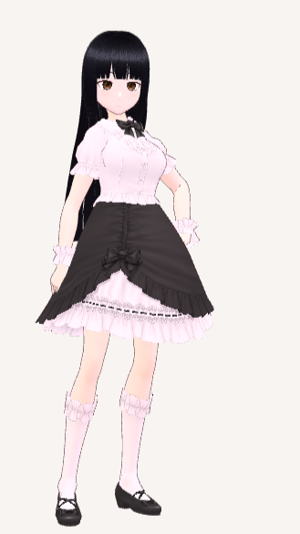
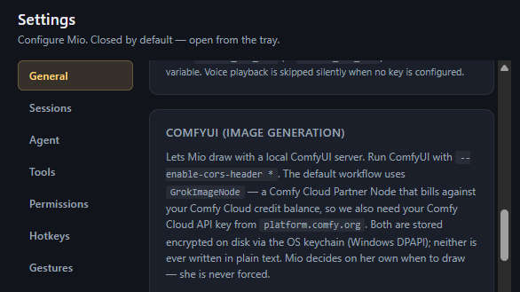

# Mio

A persistent VRM-avatar AI assistant for Windows. It runs continuously, keeps
memory across sessions, watches the screen on its own schedule, and decides for
itself when something is worth interrupting you for.

<table>
<tr>
<td width="32%"></td>
<td width="68%"></td>
</tr>
</table>

Mio is built as a **brain** and a set of **surfaces**. The brain owns everything
stateful — the agent loop, the memory store, the persona, model orchestration —
and never imports a UI framework. Surfaces are thin clients that reach it over
whichever transport is convenient.

```
Desktop host (always-on)
  brain ── agent loop · memory · persona · model orchestration
    │
    ├── Electron IPC ─────── local renderers   (always up)
    └── WebSocket + HTTP ─── any LAN client    (opt-in: MIO_LAN=1)
```

---

## What makes it interesting

**The brain is platform-agnostic by construction.** `src/server/brain/**` has
zero imports from `electron`. Every platform capability it needs — paths, secret
storage, screenshots, active-window title, notifications, outbound HTTP — crosses
a `HostAdapter` interface. A headless build supplies a different adapter and the
brain doesn't notice. It verifies in one line:

```bash
rg -n "from 'electron'" src/server     # expected: 0 matches
```

**One contract, two transports.** `shared/protocol.ts` defines a
`ServerMethodMap` of RPC verbs and a `ServerEventMap` of push events. Electron
IPC and the WebSocket server both route into the same `methods.ts` and subscribe
to the same event bus, so a turn driven from any client is visible on every
client and backed by one database. A client is simply whatever can send
`{ method, args }` and read back `{ ok, result }`.

The avatar renderer is written to the same standard: it detects its host at
runtime rather than assuming Electron, so the identical Three.js scene renders in
a plain WebView. That portability is why the renderer and protocol carry explicit
platform branches.

**Recall is a hybrid retrieval pipeline, not a similarity lookup.** Every chat
turn runs BM25 over an FTS5 index *and* cosine over the vector store, merges the
two rankings with Reciprocal Rank Fusion, applies Maximal Marginal Relevance
(λ = 0.7) so the picks aren't near-duplicates of each other, then passes the
survivors through a Flash reranker with a score floor before taking the top 6.
Short queries get raised similarity floors, because a four-word message doesn't
carry enough signal to trust a close match.

**The vector store has no vector extension.** One SQLite file via
`better-sqlite3`, embeddings as BLOBs in that same file. They're L2-normalized
*at write time*, so cosine similarity collapses to a dot product at query time.
At personal-assistant scale this is behaviourally identical to `sqlite-vec` with
one less native dependency, and migrating later is a one-table swap.

**Compaction demotes rather than deletes.** When context exceeds threshold,
older observations are summarized and the originals are *demoted* — still in the
database, dropped from the recall set. The transcript grows without bound; the
recall budget doesn't.

**Agent bounds are database rows, not prompt instructions.** Daily counters for
cycles, tokens, notifications and images are enforced in SQL. A model that
decides to be chatty cannot spend its way past them.

**The interrupt bar is the hard part.** Roughly every ten minutes the loop looks
at the screen, thinks, and writes a private JSON note to memory. Surfacing
anything is a deliberate choice against a high bar — *would they be glad I said
something?* An assistant that speaks every ten minutes is a nuisance, so most
cycles observe and stay silent.

**Touch is real input.** The avatar overlay projects the VRM's bones and
spring-bone chains into screen space each frame and hit-tests the cursor against
metre-based zones, classifying eight gesture verbs — caress, poke, pat, tickle,
stroke, grab, tug, pinch — from dwell, travel and press. Each one becomes a
synthetic user turn the model reacts to in character.

**Computer use without a native module.** Screenshots go in; mouse and keyboard
come out through PowerShell P/Invoke into `user32.dll`, under a watchdog, behind
a permission gate with a classifier, an approval dialog and an audit log.

**One storage language.** Everything persisted — messages, observations,
compaction summaries, embeddings — is Japanese. A single language keeps the
vector space clean and lets TTS read straight off the same buffer that history
replays from. The Traditional Chinese caption is a per-render translation, cached
by source text, never stored as memory.

---

## Layout

```
├── src/
│   ├── shared/protocol.ts   the contract both transports speak
│   ├── server/              transport-agnostic: brain, methods, event bus
│   │   ├── brain/           chat, agent loop, memory, recall, tools, permissions
│   │   └── transport/       ws · http · auth · mdns
│   ├── main/                Electron-only: host adapter, IPC shim, windows, tray
│   ├── preload/             contextBridge surface, one file per renderer
│   └── renderer/            avatar · chat · settings · permission · menu · overlay
├── persona.md               the shipped persona
├── assets/                  VRM models + animations — see assets/README.md
└── scripts/                 recall audit · memory inspector · WS smoke test
```

[`DEVELOPMENT.md`](./DEVELOPMENT.md) covers the architecture in depth: the
protocol contract, the transport wire format, the memory schema, and how to
extend either layer.

## Running it

```bash
npm install
npm run dev
```

Windows 10/11 and Node 22+. An Anthropic API key goes in Settings; a Gemini key
is optional and unlocks TTS, 繁中 captions, embeddings, compaction and recall
reranking. **No key ships with this repository** — keys are encrypted through the
OS credential store (DPAPI) and never touch the database, the preferences file,
or any client.

The LAN transport is **off unless `MIO_LAN=1`**. It exposes the same surface the
local renderer drives, so anything that pairs with it can read the screen, run
tools and spend API credit — a stock launch binds no port and makes no mDNS
announcement.

Avatar models and animations are mostly not redistributable and are not bundled;
[`assets/README.md`](./assets/README.md) covers what to supply and how the app
degrades without it.

---

## How this was built

I designed, specified, directed and QA'd this system; the implementation was
produced through AI-driven development under my direction. The decisions above —
the brain/surface split, the host-adapter boundary, normalizing embeddings at
write time to collapse cosine into a dot product, fusing BM25 with vector search
rather than trusting either alone, demoting rather than deleting on compaction,
putting the agent's spending limits in SQL where a prompt can't argue with them —
are mine, along with every review that sent an implementation back for missing
them.

I work this way deliberately, and I'd rather say so plainly than let a reader
guess.

## Status

Actively developed, and in daily use on my own machine. Phases 1–12 are in:
the avatar shell, streaming chat, screenshot and touch input, persistence and
persona, the agent loop with safety bounds, cross-source memory, hybrid recall
with reranking, session reflection, agent tools behind a permission layer,
computer use, and ComfyUI image generation.

## License

All rights reserved — see [`LICENSE`](./LICENSE). Published as a portfolio work
sample: readable and reviewable, not licensed for reuse. Avatar assets carry
their own separate terms.

---

**I-Shun Lo** · [ishunlo.studio](https://ishunlo.studio) · ishunl@outlook.com
